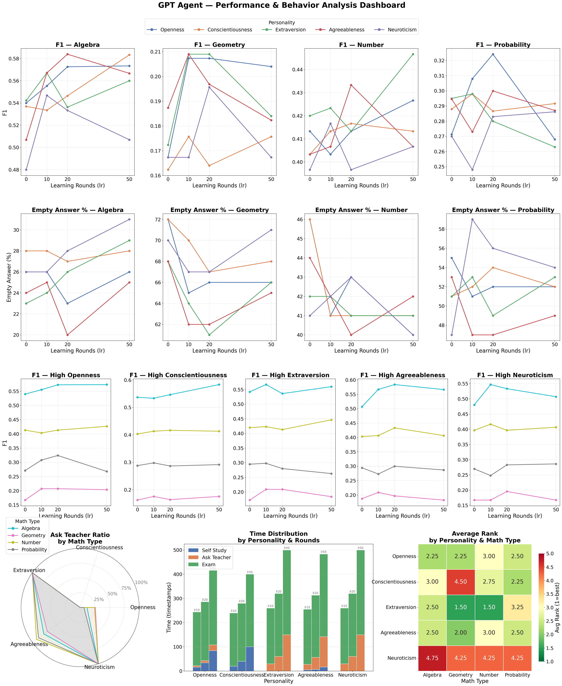

# Big Five Student — Teaching Simulation (ABM)

An agent-based model (ABM) that simulates a classroom environment where student agents with different Big Five personality traits learn mathematics and take exams. Each student agent makes autonomous decisions during learning and exam rounds, while a teacher agent responds to student queries.

---

## Overview

The simulation consists of two phases: **learning rounds** and **exam rounds**. All agents study and are tested on the same mathematical topic (e.g., Algebra). Multiple topics are evaluated separately.

### Student Agent — Learning Round

Each round, the student agent chooses one of three actions:

| Action | Steps |
|--------|-------|
| **Self-Study** | (1) Decide what to review → (2) Retrieve a relevant problem (with answer) from the question bank and store it in memory |
| **Ask Teacher** | (1) Decide what direction to ask → (2) Teacher agent retrieves and explains a related problem; result stored in memory |
| **Skip** | Do nothing this round |

### Student Agent — Exam Round

Each round, the student agent chooses one of two actions:

| Action | Steps |
|--------|-------|
| **Recall from Memory** | (1) Decide what to retrieve → (2) Retrieve the most relevant memory → (3) Use recalled memory to answer the question |
| **Answer Directly** | Answer the question without memory retrieval |

### Teacher Agent — Learning Round

When a student asks a question, the teacher agent:
1. Processes the student's question
2. Retrieves a relevant problem from the question bank
3. Explains the problem (with answer) to the student

---

## Personality Profiles

Each student agent is assigned one of five Big Five personality types, which influences its learning style and interaction behavior:

- **High Openness** — Explores connections between ideas; tolerates ambiguity
- **High Conscientiousness** — Consolidates each step before moving on; prioritizes accuracy
- **High Extraversion** — Thinks out loud; energized by dialogue
- **High Agreeableness** — Prioritizes harmony; softens disagreement
- **High Neuroticism** — Anxious about performance; seeks frequent reassurance

---

## Timestamps

Each model call consumes one timestamp unit. Since different actions trigger different numbers of model calls, each student may accumulate different total timestamps — reflecting the varying time cost of different learning strategies.

| Action | Timestamp Cost |
|--------|---------------|
| Self-study | 2 |
| Ask teacher | 3 |
| Skip | 1 |
| Exam memory recall | 1 |
| Exam answer | 1 |

> The number of decision rounds per agent is fixed, but total timestamps vary by strategy.

---

## Exam Topics

Each topic is evaluated independently:

- Algebra
- Number Theory
- Counting and Probability
- Geometry



---

## Prompt Styles

Three prompt configuration styles are provided:

| Config File | Style |
|-------------|-------|
| `config_concise.py` | Concise |
| `config_natural.py` | Natural |
| `config.py` | Explanatory |

---

## Notebooks

| Notebook | Description |
|----------|-------------|
| `runAll.ipynb` | Batch run across all personalities and topics |
| `runSingle.ipynb` | Run a single personality on a single topic |

---

## Configuration

All hyperparameters are set in the config file (`config.py`):

```python
# Model
model_type          # "api" or "local"
api_model_name      # e.g., "gpt-oss-120b"
model_path          # path to local model (if model_type = "local")

# Random seed
random_seed         # default: 42

# Exam topic
exam_topic          # "Algebra" | "Number Theory" | "Counting and Probability" | "Geometry"

# Temperature
student_temperature # default: 0.5
teacher_temperature # default: 0.3

# Token limits
max_new_tokens      # max output tokens per model call

# Learning round retrieval
retrieve_threshold  # similarity threshold
retrieve_top_k      # number of retrieved items
max_content_length  # max retrieved content length

# Exam round retrieval
retrieve_threshold  # similarity threshold
retrieve_top_k      # top-k retrieved memories
max_content_length  # max retrieved content length

# Simulation
learning_rounds     # number of learning rounds per agent
num_questions       # number of exam questions
```

Both **API mode** (e.g., GPT) and **local model** mode are supported and can be switched via `model_type` in the config.

---

## License

MIT License
